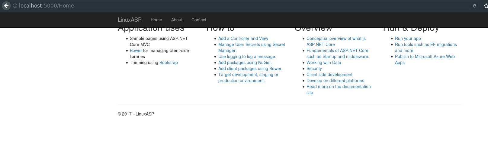

# Set up guide for Linux dotnet core asp.
---

## Introduction
I have never done an ASP app, never mind an ASP App on Linux. So this should be a 
difficult challenge. The goal of this solution is to be a base for future ASP apps
since dotnet core and Linux are heavily command line based, a Guide or a base will
speed up future development of ASP.Net Core ASP MVC apps.

If you want, you can clone the project as a base for yourself also. When you work
professionally a member of your team, or members will have done the base like this
solution and you will make more solutions/projects based upon it. But in the 
professional scenario you would be expected to know how to do this youself.

## Set Up
* Please see the set up in my other [Console App](../LinuxDotNetCore/readme.md). Besides needing a web server,
this set up should be the same.
* Then make sure to install dotnet-hosting.
```
sudo apt install dotnet-hosting-2.0.0
```

## Solution Set Up
1.  Make the ASP.Net solution directory.
```
mkdir LinuxCoreASP
cd LinuxCoreASP
dotnet new nugetconfig
dotnet new sln
```
2. Make a ASP.Net project, for the ASP stuff.
```
mkdir LinuxASP
cd LinuxASP
dotnet new mvc
cd ..
dotnet sln add ./LinuxASP/LinuxASP.csproj
```
3. Make a Library project, since you don't couple Logic and front end.
```
mkdir LibraryASP
cd LibraryASP
dotnet new classlib
cd ..
dotnet sln add ./LibraryASP/LibraryASP.csproj
```
4. Make a Testing project, since you must test your code, no matter what.
```
mkdir TestASP
cd TestASP
dotnet new mstest
cd ..
dotnet sln add ./TestASP/TestASP.csproj
```
5. Make a refrence from your front-end code and your backend code.
```
cd LinuxASP
dotnet add reference ../LibraryASP/LibraryASP.csproj
cd ..
```
6. Make a reference from your testing project to the other projects to allow them
to be tested.
```
cd TestASP
dotnet add reference ../LibraryASP/LibraryASP.csproj
dotnet add reference ../LinuxASP/LinuxASP.csproj
cd ..
```
7. Make sure everything works.
```
dotnet restore
dotnet build
dotnet test
dotnet publish
dotnet ./LinuxASP/bin/Debug/netcoreapp2.0/publish/LinuxASP.dll
```
<br/>

You should be able to visit your page using the link
 [http://localhost:5000/Home](http://localhost:5000/Home).


### Now time to save.
```
git status
git add ./**
git status
git commit -m "Example ASP MVC DotNet Core"
```